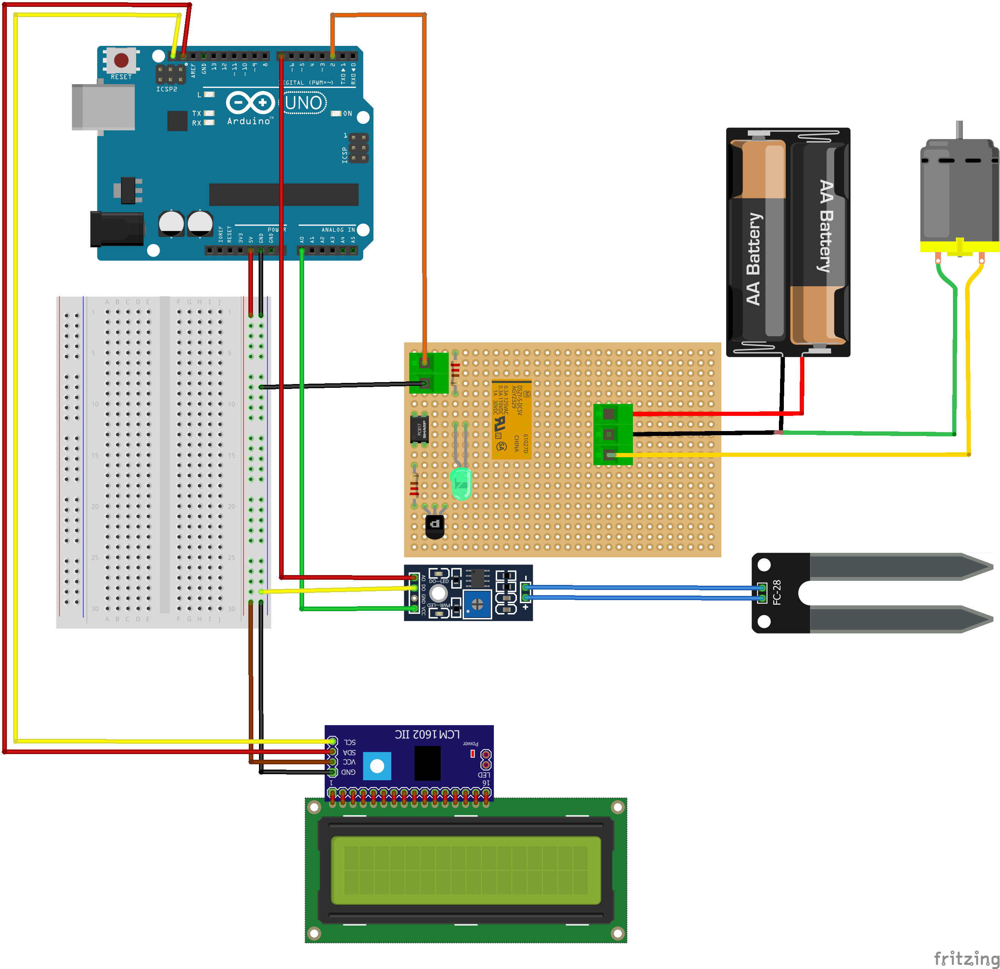
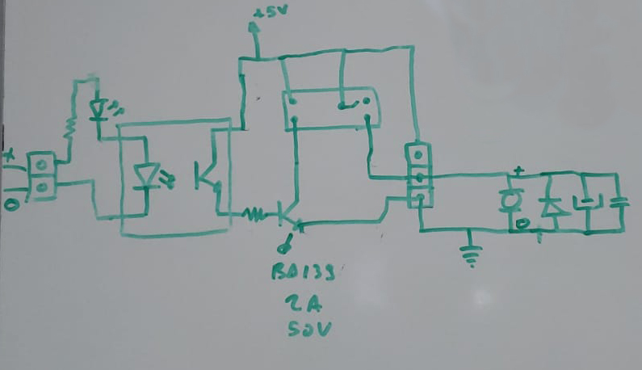

<h1>Toprağın Nem Seviyesine Göre Sulama Sistemi</h1>

Bu proje, toprağın nem seviyesini ölçerek otomatik sulama yapabilen bir Arduino tabanlı sistemdir. Bitkilerinizi optimum nem seviyesinde tutarak sağlıklı büyümelerini sağlar ve su israfını önler.

<h2>İçindekiler</h2>
<ul>
    <li><a href="#gereksinimler">Gereksinimler</a></li>
    <li><a href="#bağlantı-şeması">Bağlantı Şeması</a></li>
    <li><a href="#kurulum">Kurulum</a></li>
    <li><a href="#kullanım">Kullanım</a></li>
    <li><a href="#lisans">Lisans</a></li>
</ul>

<h2 id="gereksinimler">Gereksinimler</h2>
<ul>
    <li>Arduino UNO</li>
    <li>Toprak Nem Sensörü</li>
    <li>5V Röle Modülü (Bu hazır bir modül değildir, yapımı için sayfanın sonundaki devre çizimlerine göz atın.)</li>
    <li>Mini Dalgıç Su Pompası</li>
    <li>5V Güç Kaynağı</li>
    <li>Bağlantı kabloları</li>
    <li>Su deposu</li>
    <li>16x2 LCD Ekran ve I2C Sürücüsü</li>
</ul>

<h2 id="bağlantı-şeması">Bağlantı Şeması</h2>

<h2 id="kurulum">Kurulum</h2>
<ol>
    <li>Arduino IDE'yi indirin ve kurun: <a href="https://www.arduino.cc/en/software" target="_blank">Arduino IDE</a></li>
    <li>LCD ekranı sürmek için <a href="https://www.robolinkmarket.com/Data/EditorFiles/zip/Arduino-LiquidCrystal-I2C.zip">LiquidCrystal_I2C</a> kütüphanesini indirin.</li>
    <li>Arduino IDE -> Sketch -> Include Library -> Add .ZIP Library -> İndirdiğiniz Dosyayı Seçin.</li>
    <li>Arduino'yu bilgisayarınıza bağlayın.</li>
    <li>Aşağıdaki kodu Arduino IDE'ye kopyalayın.</li>
</ol>
<pre><code>
#include <LiquidCrystal_I2C.h>

LiquidCrystal_I2C lcd(0x27, 16, 2);

#define NEM_OLCER_GUC 7
#define NEM_OLCER_PIN A0

#define ROLE_PIN 2
#define ROLE_ACIK HIGH
#define ROLE_KAPALI LOW

#define LIMIT_SEVIYE 750

int roleOncekiDurumu = ROLE_KAPALI;
int roleSuankiDurumu = ROLE_KAPALI;

void setup() {
  pinMode(NEM_OLCER_GUC, OUTPUT);
  pinMode(ROLE_PIN, OUTPUT);
  pinMode(LED_BUILTIN, OUTPUT);

  digitalWrite(ROLE_PIN, ROLE_KAPALI);
  digitalWrite(NEM_OLCER_GUC, HIGH);
  
  lcd.begin();
  lcd.setCursor(3, 0);
  lcd.print("Nem Dusuk");

  Serial.begin(9600);
}

void loop() {
  digitalWrite(LED_BUILTIN, HIGH);
  delay(500);
  digitalWrite(LED_BUILTIN, LOW); 
  delay(500); 

  int nemSeviyesi = nemSeviyesiniOlc();
  
  if(nemSeviyesi <= LIMIT_SEVIYE){
    roleSuankiDurumu = ROLE_KAPALI;
  }else{
    roleSuankiDurumu = ROLE_ACIK;
  }
  
  Serial.println(nemSeviyesi);
  
  if(roleOncekiDurumu == roleSuankiDurumu) return;

  lcd.clear();
  lcd.setCursor(3, 0);
  if(nemSeviyesi <= LIMIT_SEVIYE){
    lcd.print("Nem Yuksek");
    digitalWrite(ROLE_PIN, ROLE_KAPALI);
  }else{
    lcd.print("Nem Dusuk");
    digitalWrite(ROLE_PIN, ROLE_ACIK);
  }

  roleOncekiDurumu = roleSuankiDurumu;
  delay(1000);
}

int nemSeviyesiniOlc() {
  digitalWrite(NEM_OLCER_GUC, HIGH);
  delay(50);
  int val = analogRead(NEM_OLCER_PIN);
  digitalWrite(NEM_OLCER_GUC, LOW);
  return val;
}
</code></pre>
<ol start="4">
    <li>Kodu yüklemek için "Yükle" düğmesine tıklayın.</li>
</ol>

<h2 id="kullanım">Kullanım</h2>
<ol>
    <li>Sistem çalışmaya başladıktan sonra, toprak nem sensörü sürekli olarak nem seviyesini ölçecektir.</li>
    <li>Nem seviyesi belirlenen eşiğin üstünde olduğunda, röle modülü su pompasını aktif hale getirecektir.</li>
    <li>Nem seviyesi eşiğin altına düştüğünde, röle modülü su pompasını kapatacaktır.</li>
</ol>
<h2 id="lisans">Röle Devre Şeması</h2>

<h2 id="lisans">Çalışma Videosu</h2>
<video src="https://github.com/seyitaldemir/Arduino-Otomatik-Bah-e-Sulama-Sistemi/assets/29175548/9cefc900-540e-48ce-a17b-4f0a93357599" width="180" />
<h2 id="lisans">Bağlantı Videosu</h2>
<video src="https://github.com/seyitaldemir/Arduino-Otomatik-Bah-e-Sulama-Sistemi/assets/29175548/669399d4-ec96-4173-9e2f-86be9d2caea0" width="180"/>
<h2 id="lisans">Lisans</h2>

Bu proje MIT Lisansı ile lisanslanmıştır. Daha fazla bilgi için <code>LICENSE</code> dosyasına bakın.

